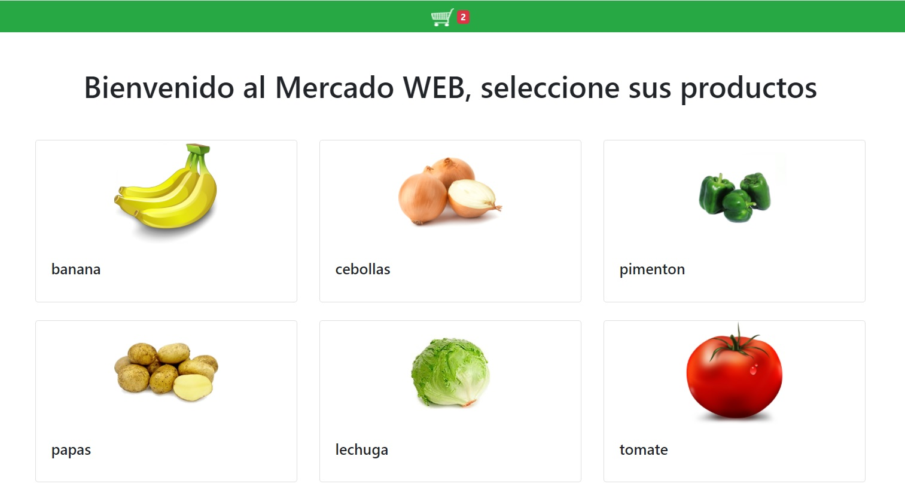
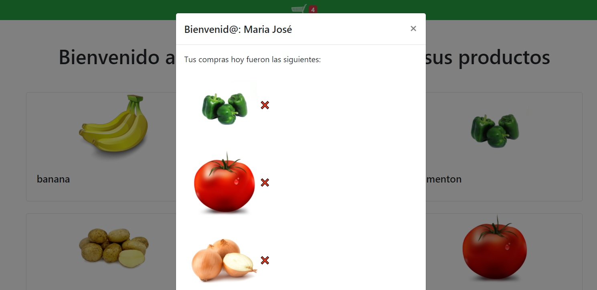
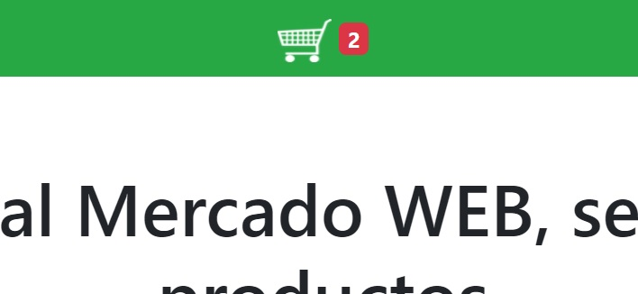

# Desafío - Mercado WEB

Construir un servidor con Express que utilice el motor de plantillas Handlebars para desarrollar componentes y renderizar variables e iteradores en el template del sitio web.

## Comenzando 🚀

_Estas instrucciones te permitirán obtener una copia del proyecto en funcionamiento en tu máquina local para propósitos de desarrollo y pruebas._

- $ git clone https://github.com/krakerbrain/desafio_mercado_web
- $ cd ../path/to/the/file
- $ npm install
- $ node server.js

### Requerimientos

1. Crear una ruta raíz que al ser consultada renderice una vista con un parcial
   “Dashboard” enviándole en el render un arreglo con los nombres de los productos. Se
   recomienda que estos coincidan con las imágenes de cada producto.
2. Incluir en la vista un parcial que contenga el menú del sitio web y sea renderizado
   antes del Dashboard.
3. Crear un parcial “producto” que contenga el template correspondiente a la
   presentación de cada producto en el Dashboard y reciba como parámetro el nombre
   del producto.
4. Crear un parcial para la sección principal en donde se renderice un helper con el
   mensaje de bienvenida y se realice una iteración para renderizar un parcial
   “producto” pasándole como argumento el nombre de cada producto.
5. Consumir los códigos fuentes de Bootstrap y jQuery a través de rutas o middlewares
   creados en el servidor. Estas dependencias deben ser instaladas con NPM.

### Implementaciones adicionales

- El proyecto podría tener la posibilidad de agregar una validación de datos de un usuario para ingresar a la compra
- Se despliega un alert cuando se agregan productos al carrito y además el ícono de la cesta de compras muestra
  un badge que indica cuantos productos hay en el carrito.
- Se implementa botón dentro del modal que elimina productos de la cesta de compras, esto a su vez modifica el badge
  del ícono del carrito de compras

##### Las siguientes imágenes representan las interacciones que debe tener el sitio web una vez terminado el desafío.

###### Así debería verse el dashboard

###### Modal desplegado con productos escogidos

###### Carrito de compras con badge

## Construido con 🛠️

- [nodeJS](https://nodejs.org/en/)

#### Usando las librerías:

- [Express](https://expressjs.com/es/)
- [Handlebars](https://handlebarsjs.com/)
- [Bootstrap](https://getbootstrap.com/)

## Autores ✒️

- **Arlene Santos**
- **Eric Leiva**
- **Diego Madariaga**
- **Mario Montenegro**
